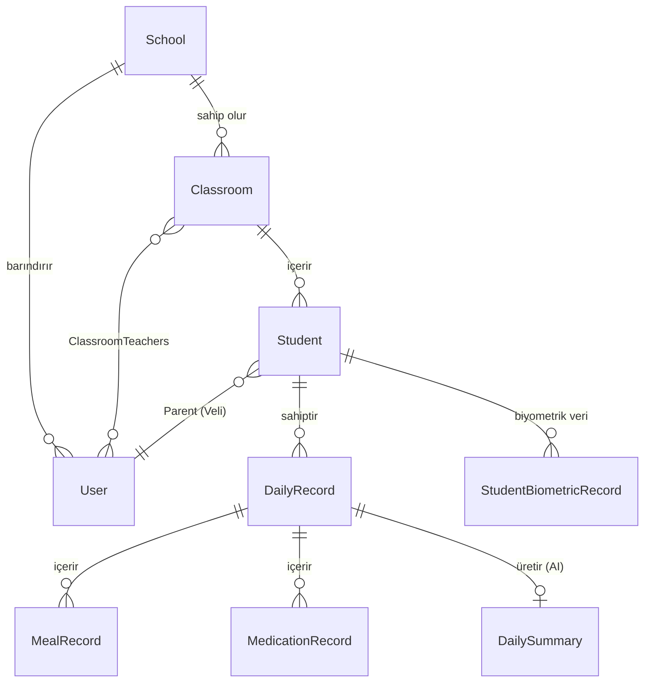
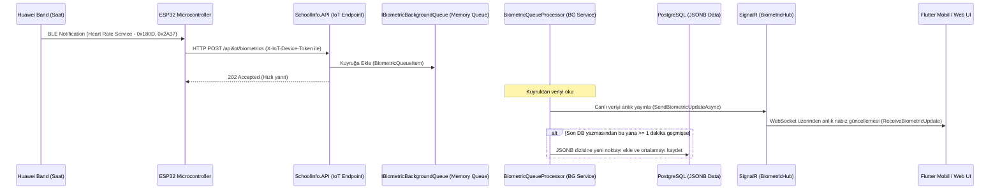

# 🤖 SchoolInfo — Yapay Zeka (AI) & Geliştirici Uyum Kılavuzu (AI_CONTEXT.md)

Bu doküman, sisteme dahil olan yapay zeka ajanlarının veya yeni yazılımcıların **SchoolInfo (Preschool Management System)** projesini hızla kavraması, mimariyi öğrenmesi ve kod tabanında güvenle değişiklik yapabilmesi için hazırlanmıştır.

---

## 🏗️ 1. Genel Teknoloji Yığını (Tech Stack)

Sistem 4 ana parçadan oluşmaktadır:
1. **Backend API (.NET 10.0 & Minimal API)**: CQRS, FluentValidation, MediatR, PostgreSQL + EF Core, JWT Auth.
2. **Yapay Zeka (Microsoft.Agents.AI)**: Günlük öğrenci kayıtlarını konsolide edip ebeveynler için pedagojik, samimi özetler üreten GPT-4o entegrasyonu.
3. **Web Arayüzü (ASP.NET Core MVC)**: Öğretmenlerin günlük veri (yemek, uyku, aktivite vb.) girişi yaptığı ve SignalR ile canlı nabız uyarılarını izlediği portal.
4. **Mobil Uygulama (Flutter & Riverpod)**: Velilerin çocuklarının günlük akışını takip ettiği ve SignalR üzerinden anlık nabız grafiğini izlediği mobil istemci.
5. **IoT Donanım (ESP32 & BLE C++)**: Sınıftaki çocukların Huawei Band akıllı saatlerine BLE (Bluetooth Low Energy) ile bağlanıp canlı nabız verilerini API'ye aktaran gömülü yazılım.

---

## 📁 2. Proje Klasör Yapısı ve Katmanlar

Sistem **Clean Architecture** kurallarına göre yapılandırılmıştır:

```text
SchoolInfo/
├── src/
│   ├── SchoolInfo.Domain/                  # Bağımsız Çekirdek Katman (Entities, Value Objects, Enums)
│   │   ├── Entities/                       # Db tablolarına karşılık gelen DDD aggregate root'lar
│   │   ├── ValueObjects/                   # Immutable kayıtlar (örn: WaterConsumption, SleepInfo)
│   │   └── Interfaces/                     # Repository arayüz tanımları
│   │
│   ├── SchoolInfo.Application/             # İş Mantığı Katmanı (CQRS Commands, Queries, Behaviors)
│   │   └── Features/                       # Her dikey özellik (Feature) kendi klasöründe (MediatR)
│   │       ├── DailySummary/               # AI Özetleme komutları
│   │       └── Biometrics/                 # Biyometrik sorgular
│   │
│   ├── SchoolInfo.Infrastructure/          # Dış Entegrasyonlar ve Veritabanı Katmanı
│   │   ├── Persistence/                    # EF Core AppDbContext, FluentConfigurations, Repositories
│   │   ├── AI/                             # Microsoft.Agents.AI - SchoolAIAgent entegrasyonu
│   │   ├── BackgroundServices/             # Gün sonu AI tetikleyici (Scheduler) ve IoT veri kuyruğu işleyici
│   │   └── DependencyInjection.cs          # Altyapı servislerinin IoC kaydı
│   │
│   ├── SchoolInfo.API/                     # Sunum / Minimal API Katmanı
│   │   ├── Endpoints/                      # IEndpoint arayüzünü uygulayan API yönlendirmeleri
│   │   ├── Hubs/                           # SignalR BiometricHub (Gerçek zamanlı WebSocket)
│   │   └── Program.cs                      # Uygulama başlangıç ve middleware ayarları
│   │
│   ├── SchoolInfo.Web/                     # ASP.NET Core MVC Web Portalı (Öğretmen & Admin)
│   │   ├── Controllers/                    # TeacherController, ParentController vb.
│   │   └── Views/                          # ClassroomDetails.cshtml gibi öğretmen defteri ekranları
│   │
│   ├── SchoolInfo.Mobil/                   # Flutter Mobil Uygulaması (Veli)
│   │   ├── lib/
│   │   │   ├── core/services/              # Custom SignalR WebSocket istemcisi (biometric_signalr_service.dart)
│   │   │   └── features/home/presentation/ # Veli ana ekranı ve canlı grafik (biometrics_history_screen.dart)
│   │
│   └── ESP32_Biyometrik_Sensor/            # ESP32 C++ Arduino Kodları (BLE + WiFi HTTP POST)
```

---

## 🗄️ 3. Veritabanı Modeli ve Kritik İlişkiler

Veritabanı ilişkileri ve tenant izolasyon yapısı aşağıda özetlenmiştir:



### Multi-Tenant Güvenlik İzolasyonu
* Neredeyse tüm tablolar `SchoolId` (Tenant Anahtarı) sütununa sahiptir.
* [AppDbContext.cs](file:///C:/Users/mhmtp/Desktop/1-Projeler/Work/SchoolInfo/src/SchoolInfo.Infrastructure/Persistence/AppDbContext.cs) üzerinde EF Core'un **Global Query Filters** yapısı kullanılarak, silinmiş kayıtlar (`IsDeleted`) otomatik elenir.
* API'ye gelen her istekten JWT parse edilerek `ICurrentUserService.SchoolId` elde edilir ve tüm veritabanı işlemleri bu ID üzerinden izole edilir.

---

## ⌚ 4. IoT Biyometrik Veri Akış Şeması

Akıllı saatten velinin/öğretmenin ekranına kadar olan veri iletim süreci:



### Kritik Detaylar:
1. **DB Yükünü Engelleme (Throttling)**: ESP32 veriyi 3 saniyede bir atar. Veritabanının çökmesini engellemek için [BiometricQueueProcessor.cs](file:///C:/Users/mhmtp/Desktop/1-Projeler/Work/SchoolInfo/src/SchoolInfo.Infrastructure/BackgroundServices/BiometricQueueProcessor.cs) gelen verileri hafızada biriktirir ve sadece dakikada 1 kez PostgreSQL'e toplu (JSONB formatında) yazar.
2. **Anlık Dağıtım (Zero-Latency)**: Veritabanına yazma sıklığı 1 dakika olsa da, gelen tüm ham veriler SignalR Hub üzerinden velilere ve öğretmenlere **0 milisaniye gecikmeyle** canlı olarak iletilir.

---

## 🤖 5. Yapay Zeka (AI) Gün Sonu Özet Süreci

Öğretmenin girdiği günlük kayıtları veliye özetlenirken şu adımlar izlenir:
1. **Zamanlayıcı (Scheduler)**: Arka planda çalışan [DailySummaryScheduler.cs](file:///C:/Users/mhmtp/Desktop/1-Projeler/Work/SchoolInfo/src/SchoolInfo.Infrastructure/BackgroundServices/DailySummaryScheduler.cs) her gün saat 17:00'de tetiklenir.
2. **Maliyet Optimizasyonu (On-Demand Generation)**: Scheduler doğrudan Gemini/GPT API'sini tetiklemez. Sadece velilere *"Bugünün günlüğü hazır"* bildirimi gönderir. Veli uygulamayı açıp çocuğunun özet sayfasına girdiğinde API tetiklenir ve özet o an üretilerek veritabanına kaydedilir. Böylece sisteme girmeyen veliler için gereksiz AI çağrı maliyeti oluşmaz.
3. **Rol İzinleri**: Özet oluşturma komutu (`GenerateDailySummaryCommand`), yetkilendirme doğrulaması gerektirir.

---

## 🗄️ 6. Bilinmesi Gereken Geliştirici Kuralları ve Standartları

* **Tarih Saat Standardı**: PostgreSQL ile zaman dilimi uyuşmazlığı yaşamamak için tüm tarihler veritabanına kaydedilmeden önce `.Date` seviyesinde `DateTime.SpecifyKind(date, DateTimeKind.Utc)` ile UTC olarak işaretlenmelidir.
* **SignalR WebSocket Protokolü (Flutter)**: Flutter tarafında platform uyumsuzluğu yaşamamak için standart SignalR kütüphaneleri yerine WebSocket üzerinden raw JSON protokolü (`type: 1`, `target: 'ReceiveBiometricUpdate'`) el sıkışmalı (ASCII 30 `\x1e`) olarak uygulanmıştır. Kod incelemesi için [biometric_signalr_service.dart](file:///C:/Users/mhmtp/Desktop/1-Projeler/Work/SchoolInfo/src/SchoolInfo.Mobil/lib/core/services/biometric_signalr_service.dart) dosyasını inceleyin.
* **Soft Delete**: Silme işlemleri fiziksel olarak `DELETE` sorgusu çalıştırmaz. İlgili aggregate root'un `IsDeleted` bayrağını `true` yapar. Global filtreler bunu otomatik gizler.

---

## 🎯 7. Geliştirme Sürecindeki Eksikler ve Düzeltilecek Noktalar

1. 🐞 **Veli Rolünün AI Özet Tetikleme Hatası**: Velilerin on-demand özet isteyebilmesi için `GenerateDailySummaryCommandHandler` içerisindeki yetki kontrolüne `Parent` rolünün eklenmesi.
2. 📱 **Mobil Canlı Kritik Uyarılar**: Veli mobil uygulamasında SignalR'dan gelen nabız verisinin kritik değerlerin (<60 veya >130) dışına çıktığında kırmızı banner uyarısı vermesi için `home_screen.dart` dosyasındaki `_checkCriticalHeartRate` fonksiyonunun geri kazandırılması.
3. 🔔 **Sunucu Tabanlı FCM Sağlık Bildirimleri (Opsiyonel)**: Canlı SignalR bağlantısı olmasa dahi, arka planda nabız uzun süre kritik seviyede kalırsa Firebase Cloud Messaging ile öğretmen ve veliye acil push bildirim gönderilmesi.
