# 🏫 SchoolInfo — Okul Öncesi Bilgi Sistemi

> Anaokulları ve kreşler için AI destekli, multi-tenant okul yönetim platformu.  
> Öğretmen-veli iletişimini güçlendirir, günlük rutinleri takip eder ve yapay zeka ile kişiselleştirilmiş özetler üretir.

---

## 🚀 Kullanılan Teknolojiler

### 🖥️ Backend & Framework
| Teknoloji | Versiyon | Kullanım Amacı |
|---|---|---|
| **.NET** | 10.0 | Ana platform |
| **Minimal API** | .NET 10 built-in | HTTP endpoint'leri (Controller yok) |
| **C#** | Latest | Programlama dili |

### 🗄️ Veritabanı
| Teknoloji | Versiyon | Kullanım Amacı |
|---|---|---|
| **PostgreSQL** | Latest | Ana ilişkisel veritabanı |
| **EF Core** | 9.x → 10 | ORM (Code First, Fluent API) |
| **Npgsql** | 9.x | PostgreSQL EF Core provider |

### 🤖 Yapay Zeka
| Teknoloji | Versiyon | Kullanım Amacı |
|---|---|---|
| **Microsoft.Agents.AI** | 1.0 (preview) | AI Agent orkestrasyon framework |
| **Microsoft.Agents.AI.Foundry** | 1.0 (preview) | Azure AI Foundry bağlantısı |
| **Azure.AI.Projects** | preview | Azure AI proje yönetimi |
| **Azure.Identity** | latest | Azure kimlik doğrulama |
| **GPT-4o** | — | Günlük özet üretimi için LLM modeli |

### 🔐 Güvenlik & Auth
| Teknoloji | Versiyon | Kullanım Amacı |
|---|---|---|
| **JWT Bearer** | 9.x | Token tabanlı kimlik doğrulama |
| **BCrypt.Net-Next** | 4.2.0 | Şifre hashleme |
| **Role-Based Auth** | .NET built-in | Admin / Teacher / Parent rolleri |

### 📦 Uygulama Katmanı Kütüphaneleri
| Teknoloji | Versiyon | Kullanım Amacı |
|---|---|---|
| **MediatR** | 12.x | CQRS mediator implementasyonu |
| **FluentValidation** | 11.x | Command validasyon kuralları |
| **Microsoft.Extensions.Logging** | 9.x | Structured logging |

### 📬 Bildirimler
| Teknoloji | Versiyon | Kullanım Amacı |
|---|---|---|
| **Firebase Admin SDK** | 3.x | Push notification (FCM) |

### 🧪 Test
| Teknoloji | Versiyon | Kullanım Amacı |
|---|---|---|
| **xUnit** | — | Unit test framework |
| **Moq** | — | Mock/stub kütüphanesi |
| **FluentAssertions** | — | Okunabilir assertion'lar |

---

## 📊 İş Akışları (Visual Workflows)

### 1. 🏫 Sistem Kurulumu ve Yönetim
Admin tarafından okulun ve sınıfların yapılandırılması.

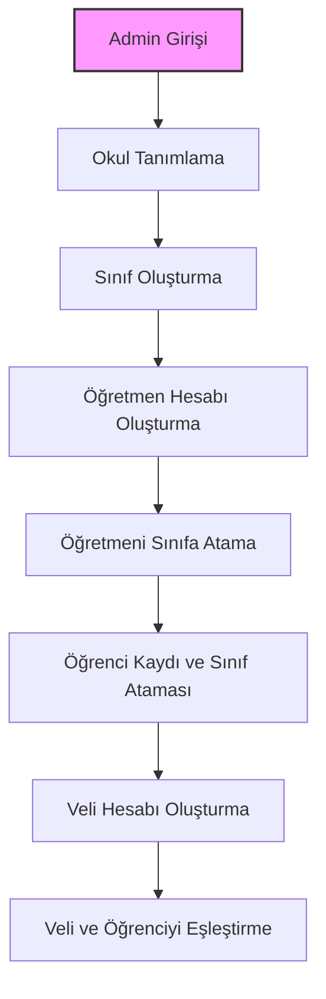

### 2. 📝 Günlük Operasyon ve AI Özetleme
Öğretmenin veri girişi ve sistemin gün sonunda AI özeti üretmesi.

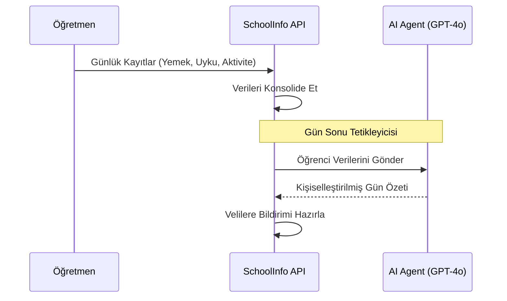

### 3. 👨‍👩‍👧 Veli Bilgilendirme
Velinin sistem üzerinden çocuğunu takip etmesi.

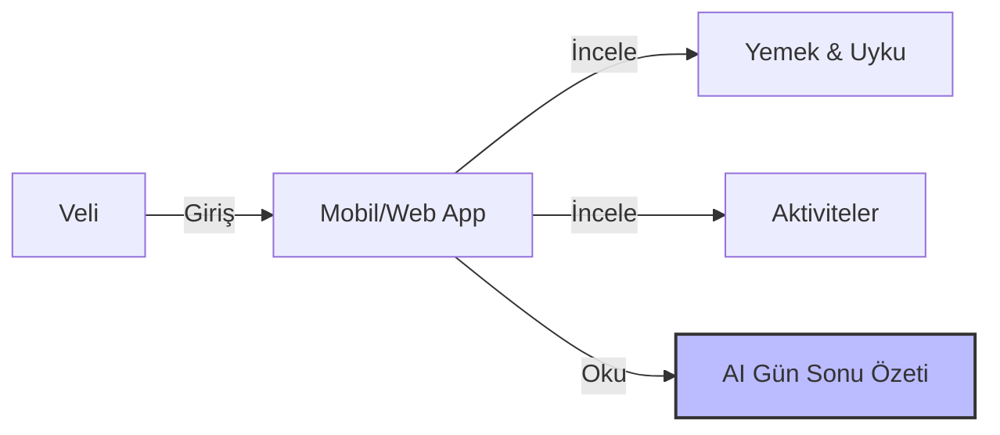

---

## 🏗️ Mimari Yapı — Clean Architecture + DDD

Proje **Clean Architecture** prensiplerine ve **Domain-Driven Design (DDD)** kurallarına uygun olarak 4 ana katmandan oluşur. Bağımlılık yönü her zaman içe doğrudur: **API → Application → Domain**. Infrastructure da sadece Domain'e bağlıdır.

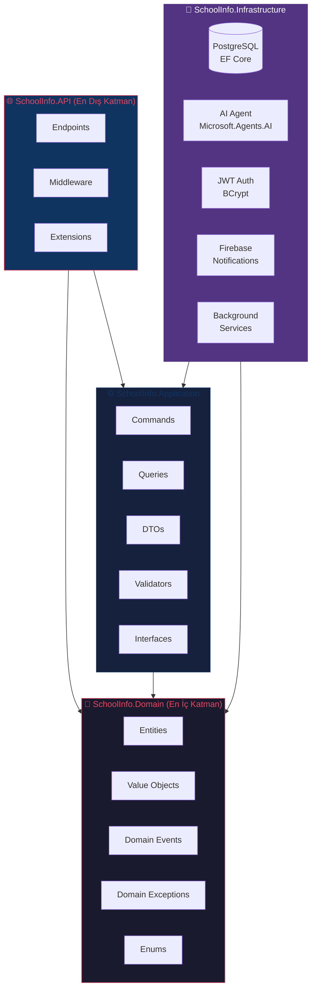

### Katman Sorumlulukları

| Katman | Proje | Sorumluluk |
|---|---|---|
| **Domain** | `SchoolInfo.Domain` | Entity'ler, Value Object'ler, Domain Event'ler, iş kuralları |
| **Application** | `SchoolInfo.Application` | CQRS handlers, DTO'lar, validasyon, interface tanımları |
| **Infrastructure** | `SchoolInfo.Infrastructure` | DB, AI, Auth, Bildirim implementasyonları |
| **API** | `SchoolInfo.API` | Minimal API endpoint'leri, middleware, DI kaydı |

---

## 🎨 Tasarım Desenleri (Design Patterns)

### 1. 🏛️ Clean Architecture

Bağımlılıklar her zaman dıştan içe akar. Domain katmanı hiçbir dış bağımlılık taşımaz.

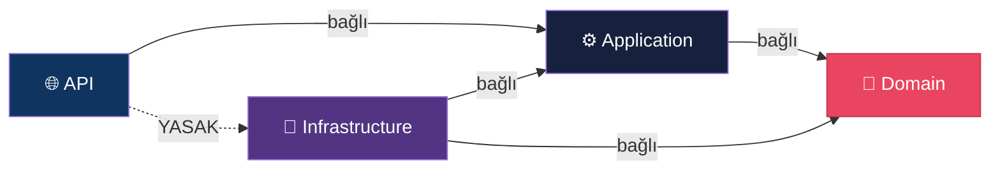

---

### 2. 📨 CQRS (Command Query Responsibility Segregation)

Okuma ve yazma işlemleri birbirinden ayrılmıştır. Her feature kendi `Commands/` ve `Queries/` klasörüne sahiptir.

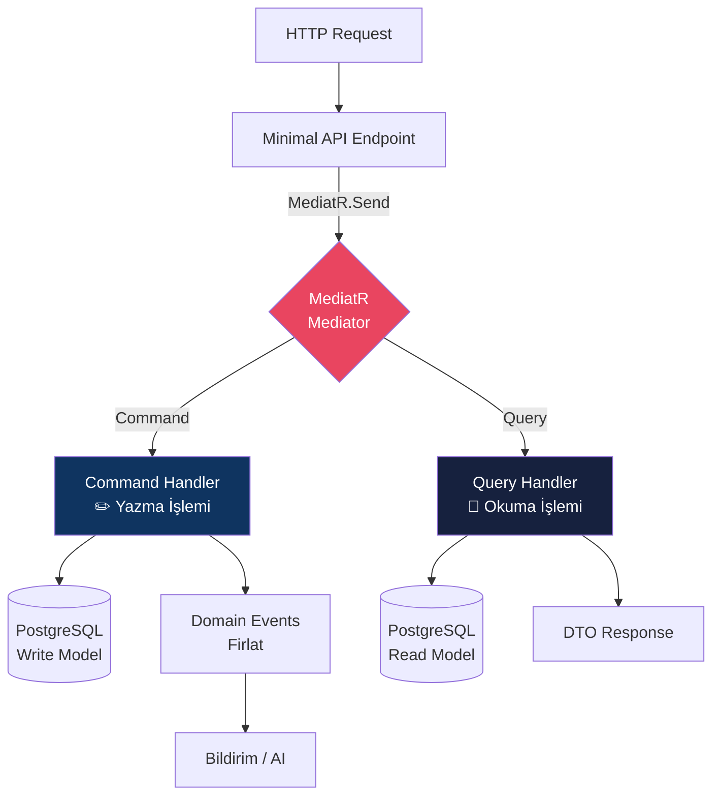

**Örnek Feature Yapısı (DailySummary):**
```
Features/
└── DailySummary/
    ├── Commands/
    │   └── GenerateDailySummary/
    │       ├── GenerateDailySummaryCommand.cs
    │       ├── GenerateDailySummaryHandler.cs
    │       └── GenerateDailySummaryValidator.cs
    └── Queries/
        └── GetDailySummary/
            ├── GetDailySummaryQuery.cs
            └── GetDailySummaryHandler.cs
```

---

### 3. 🗃️ Repository Pattern

Domain nesneleri her zaman repository arayüzü üzerinden erişilir. Infrastructure detayları Application katmanından gizlenir.

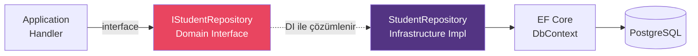

---

### 4. 🌐 Domain-Driven Design (DDD)

#### Aggregate Yapısı

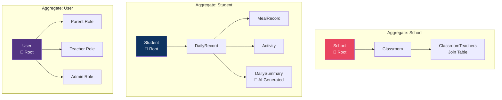

#### DDD Kuralları
- **Entity'ler:** Tüm setter'lar `private` — değişim sadece domain metotları ile
- **Value Object'ler:** `immutable record` — EF Owned Entity olarak map edilir
- **Domain Events:** MediatR ile fırlatılır, iş kuralı ihlalleri `DomainException` üretir

---

### 5. 🔒 Multi-Tenant Pattern

Her okul verisi `school_id` ile tamamen izole edilmiştir.

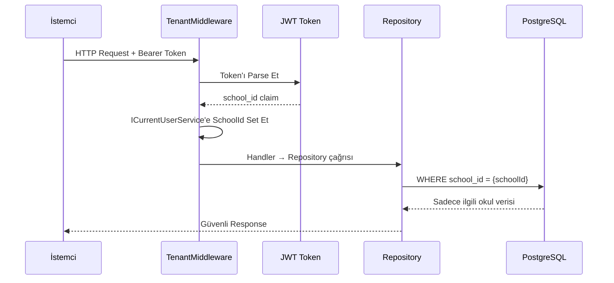

---

### 6. 🤖 AI Agent Pattern (Microsoft Agent Framework)

Gün sonu tetikleyicisi ile AI agent, her öğrenci için kişiselleştirilmiş özet üretir.

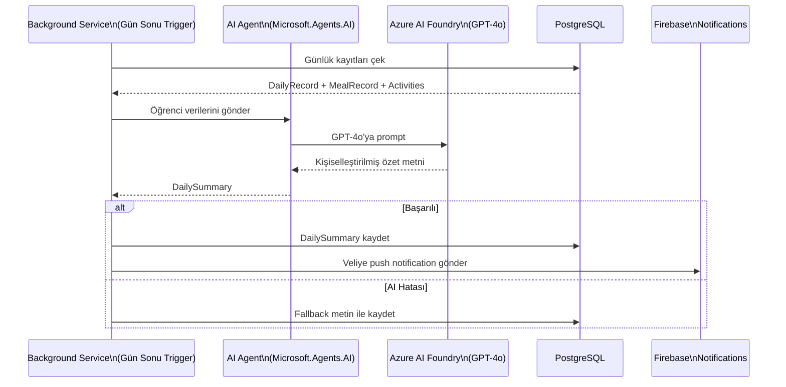

---

### 7. 🛡️ Hata Yönetimi Pattern

Tüm exception'lar merkezi middleware tarafından yakalanır ve standart formata dönüştürülür.

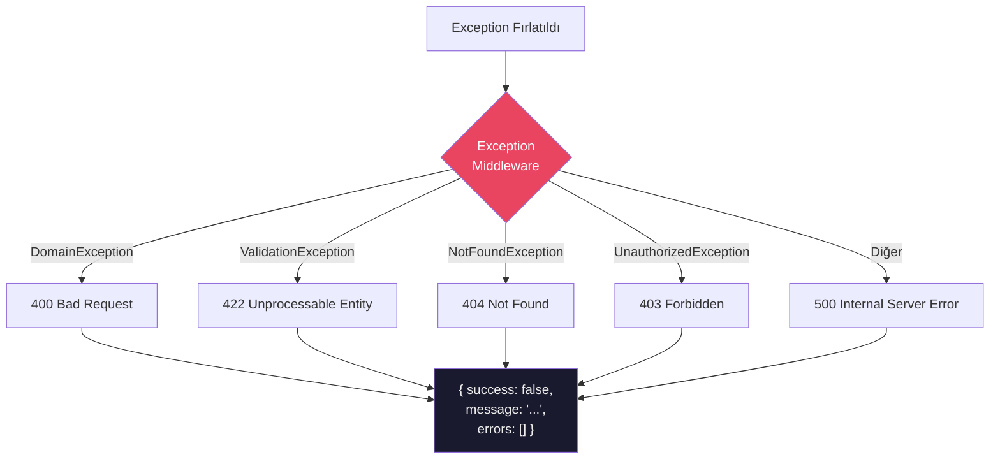

---

## 📁 Proje Klasör Yapısı

```
SchoolInfo/
├── src/
│   ├── SchoolInfo.Domain/           🎯 DDD Domain Katmanı
│   │   ├── Entities/                   (School, Classroom, Student, User...)
│   │   ├── ValueObjects/               (immutable records)
│   │   ├── Enums/                      (UserRole, MealType, SleepStatus...)
│   │   ├── Events/                     (Domain Events - MediatR)
│   │   ├── Exceptions/                 (DomainException, NotFoundException...)
│   │   └── Interfaces/                 (IRepository<T>, ICurrentUserService...)
│   │
│   ├── SchoolInfo.Application/      ⚙️ CQRS + İş Mantığı
│   │   ├── Common/                     (BaseResponse, PaginatedResult...)
│   │   └── Features/                   (Her feature kendi klasöründe)
│   │       ├── Students/
│   │       │   ├── Commands/
│   │       │   └── Queries/
│   │       ├── Classrooms/
│   │       ├── DailyRecords/
│   │       ├── MealRecords/
│   │       ├── Activities/
│   │       ├── DailySummary/
│   │       ├── Schools/
│   │       └── Users/
│   │
│   ├── SchoolInfo.Infrastructure/   🔧 Dış Servis Implementasyonları
│   │   ├── Persistence/
│   │   │   ├── AppDbContext.cs
│   │   │   ├── Configurations/         (Fluent API EF Config)
│   │   │   └── Repositories/           (Repository implementasyonları)
│   │   ├── AI/                         (Microsoft.Agents.AI entegrasyonu)
│   │   ├── Auth/                       (JWT + BCrypt)
│   │   ├── Notifications/              (Firebase FCM)
│   │   ├── BackgroundServices/         (Gün sonu AI trigger)
│   │   └── DependencyInjection.cs
│   │
│   └── SchoolInfo.API/              🌐 Minimal API Katmanı
│       ├── Endpoints/                  (IEndpoint implement eden gruplar)
│       ├── Middleware/                 (Auth, Tenant, Exception handling)
│       └── Extensions/                 (WebApplication extension'ları)
│
└── tests/
    └── SchoolInfo.Tests/            🧪 xUnit + Moq + FluentAssertions
```

---

## 📊 Domain Model (Varlık İlişkileri)

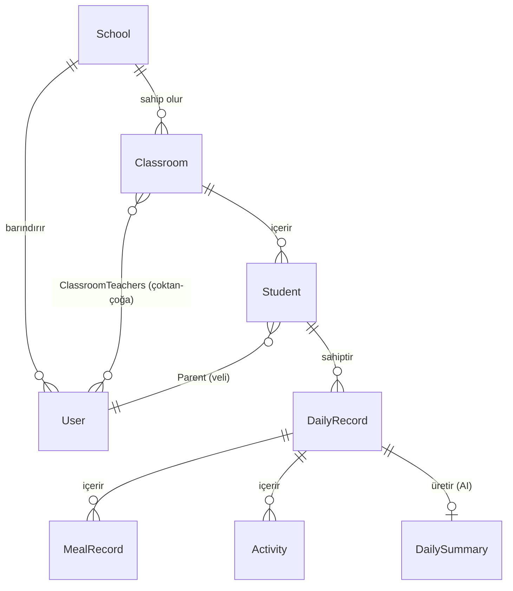

---

## 🔐 Güvenlik & Yetkilendirme

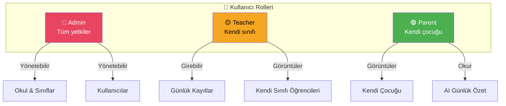

### Multi-Tenant Güvenlik Kuralları
- Her tabloda `school_id` kolonu zorunlu
- JWT token içinde `school_id` claim taşınır
- Her repository metodu `school_id` filtresi uygular
- Farklı okul verileri **kesinlikle** birbirine karışmaz

---

## 🛠️ Kurulum

### Önkoşullar
- .NET 10 SDK
- PostgreSQL 15+
- Azure AI Foundry erişimi (AI özelliği için)
- Firebase projesi (push notification için)

### Adımlar

**1. Yapılandırma**
```json
// appsettings.json
{
  "ConnectionStrings": {
    "DefaultConnection": "Host=localhost;Database=schoolinfo;Username=postgres;Password=..."
  },
  "Jwt": {
    "SecretKey": "...",
    "Issuer": "SchoolInfo",
    "Audience": "SchoolInfoApp"
  },
  "AgentFramework": {
    "Endpoint": "https://<your-foundry>.openai.azure.com/",
    "ApiKey": "...",
    "Model": "gpt-4o"
  }
}
```

**2. Migration Uygulama**
```bash
dotnet ef database update --project src/SchoolInfo.Infrastructure --startup-project src/SchoolInfo.API
```

**3. Projeyi Çalıştırma**
```bash
dotnet run --project src/SchoolInfo.API
```

**4. Test Çalıştırma**
```bash
dotnet test tests/SchoolInfo.Tests
```

---

## 📝 Lisans
Bu proje özel bir mülkiyettir. Tüm hakları saklıdır.
