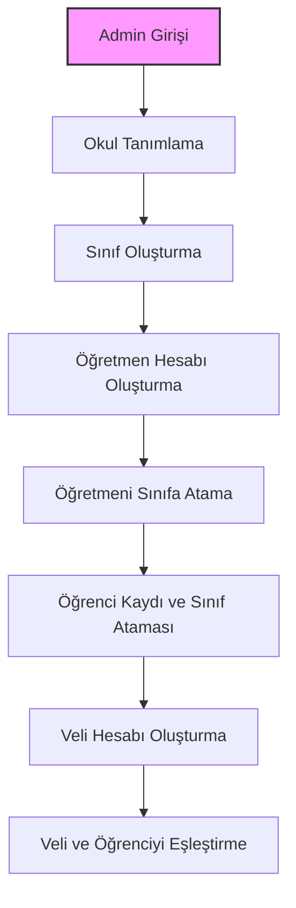
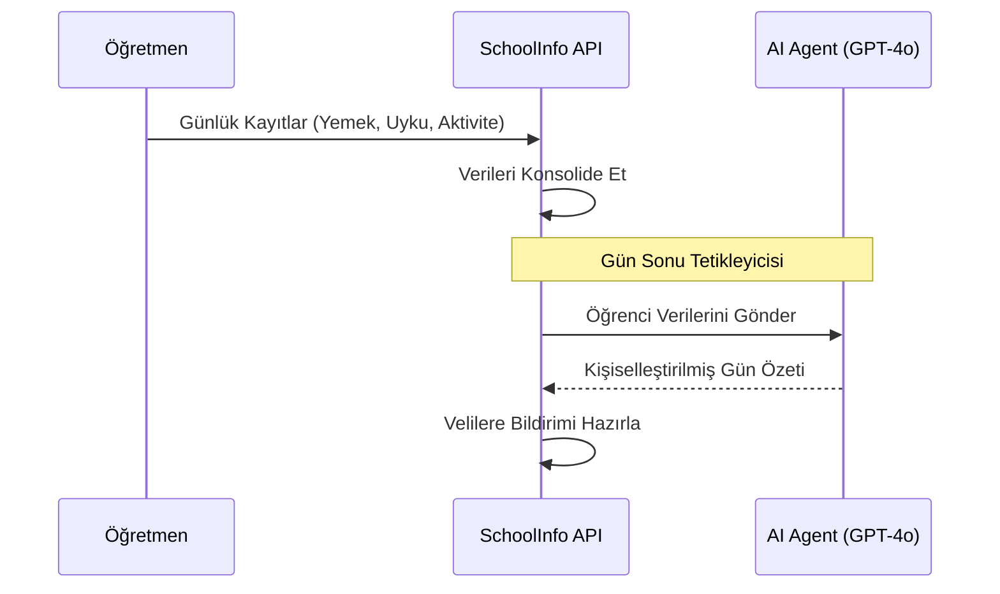
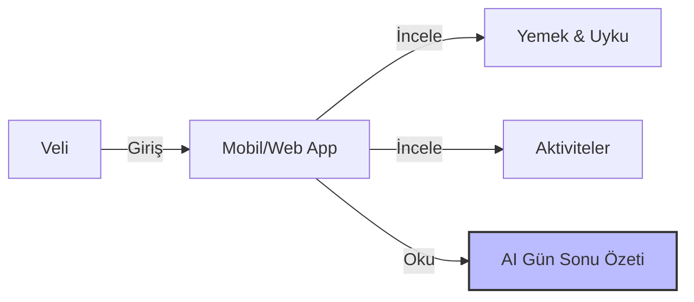

# SchoolInfo - Okul Öncesi Bilgi Sistemi

SchoolInfo, anaokulları ve kreşler için tasarlanmış, öğretmen-veli iletişimini güçlendiren ve yapay zeka destekli günlük özetler sunan modern bir okul yönetim sistemidir.

## 🚀 Teknolojiler
- **Backend:** .NET 10 (Minimal API)
- **Mimari:** Clean Architecture + Domain Driven Design (DDD)
- **Veritabanı:** PostgreSQL + EF Core 10
- **AI:** Microsoft Agent Framework 1.0
- **Patternler:** CQRS (MediatR), Repository Pattern
- **Güvenlik:** JWT + Role Based Authorization

## 🏗️ Mimari Yapı
Proje Clean Architecture prensiplerine uygun olarak 4 ana katmandan oluşur:

1.  **SchoolInfo.Core (Domain):** Entity'ler, Value Object'ler ve domain mantığı.
2.  **SchoolInfo.Application:** İş mantığı, CQRS (Commands/Queries), DTO'lar.
3.  **SchoolInfo.Infrastructure:** Veritabanı erişimi, AI entegrasyonu, kimlik doğrulama.
4.  **SchoolInfo.API:** Minimal API endpoint'leri ve middleware yapısı.

---

## 📊 İş Akışları (Visual Workflows)

### 1. Sistem Kurulumu ve Yönetim
Admin tarafından okulun ve sınıfların yapılandırılması.



### 2. Günlük Operasyon ve AI Özetleme
Öğretmenin veri girişi ve sistemin gün sonunda AI özeti üretmesi.



### 3. Veli Bilgilendirme
Velinin sistem üzerinden çocuğunu takip etmesi.



---

## 🛠️ Kurulum

1.  **Veritabanı Yapılandırması:** `appsettings.json` içindeki PostgreSQL bağlantı dizesini güncelleyin.
2.  **Migration Uygulama:**
    ```bash
    dotnet ef database update --project src/SchoolInfo.Infrastructure --startup-project src/SchoolInfo.API
    ```
3.  **Projeyi Çalıştırma:**
    ```bash
    dotnet run --project src/SchoolInfo.API
    ```

## 🔒 Güvenlik Kuralları
- **Multi-Tenant:** Her okulun verisi `school_id` ile izole edilmiştir.
- **Roller:** `Admin`, `Teacher`, `Parent`.
- **Erişim:** Her öğretmen sadece kendi sınıflarına, her veli sadece kendi çocuğuna erişebilir.

---

## 📝 Lisans
Bu proje özel bir mülkiyettir. Tüm hakları saklıdır.
