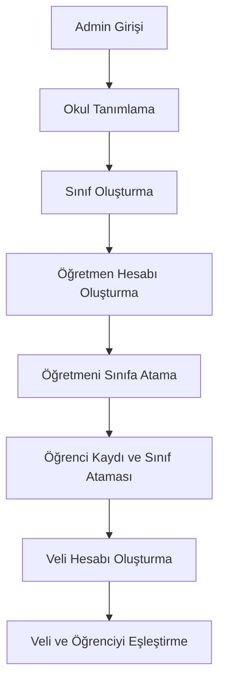
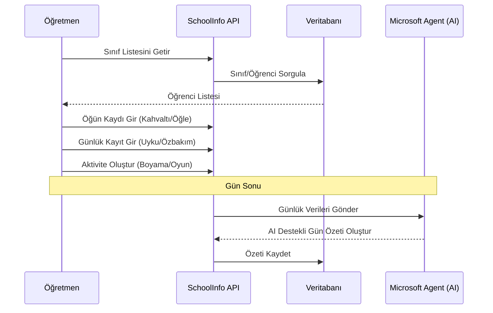
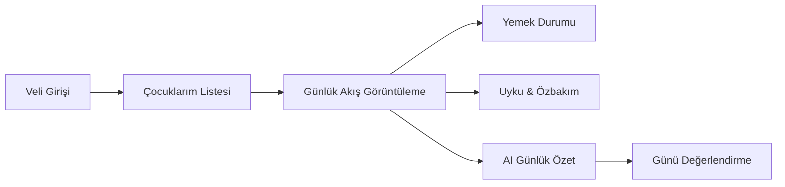
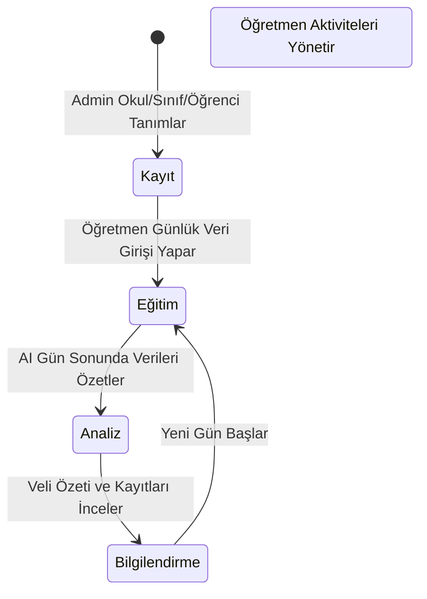

# SchoolInfo Kullanıcı İş Akışı

Bu doküman, sistemdeki temel rollerin (Admin, Öğretmen, Veli) ana iş akışlarını görselleştirir.

## 1. Sistem Kurulum Akışı (Admin)
Admin'in okulu, sınıfları ve kullanıcıları sisteme tanımlama sürecidir.

## 2. Günlük Eğitim Akışı (Öğretmen)
Öğretmenin gün içinde yaptığı kayıtlar ve AI özet süreci.

## 3. Bilgilendirme Akışı (Veli)
Velinin çocuğunun durumunu takip etme süreci.

## 4. Genel Sistem Yaşam Döngüsü

